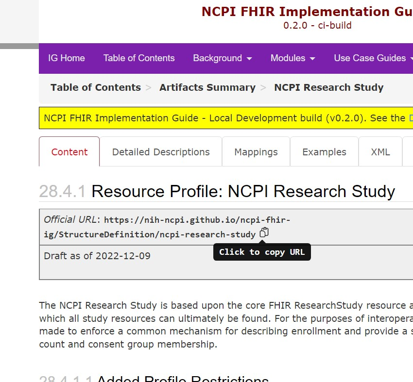

# Profiles
The NCPI FHIR Implementation Guide (IG) provides some recommended profiles with the goal of providing consistency for research data stored in FHIR. It is therefore, highly recommended that those storing research data in FHIR use those profiles and the accompanying recommendations for handling each of the supported use cases. 

While each of the various FHIR Server implementations are likely to have a proprietary way of loading profile definitions into their respective servers, FHIR provides the ability to load those definitions directly via the standard REST Api that you normally use to load actual resource data. To make this a bit more streamlined, Whistler provides a simple tool that will grab those definitions from ether an IG that has been published on the web or that has been compiled locally on the users system. 

## igload 
The tool, *igload* works similarly to the other Whistler tools you've used in this tutorial. It uses a YAML config file which contains details about the IG(s) to draw the resources from and has some basic arguments and settings that can be used to restrict from the definitions in those IGs to only be the ones desired. 

To kick things off, we need to create our YAML configuration file. Luckily, igload can do most of the work for us: 
```
$ igload --generate-default > ncpi.yaml
```

And, if you open that file up, you will see something like this:
```ncpi.yaml
NCPI-FHIR-IG:
  # Source types can include:
  #   - IG - for resources that are the end product of HL7's publisher.jar
  #          application. The IG can be a local path or a published IG
  source_type: IG
  # For IGs publised to the web, point to the root directory containing the
  # preferred version of the IG website. There should be a zip file containing
  # the resource items which will be downloaded and subsequently loaded into
  # the FHIR server
  url: https://nih-ncpi.github.io/ncpi-fhir-ig
  #
  # If the IG exists locally on your machine, you can point to that directory
  # instead. This assumes that the products to be loaded are found in the
  # output directory and have been zipped up according to standard publisher
  # behavior
  # path: /some/local/path/to/ig

  # List of resources to load. If you only care to load CodeSystem and
  # ValueSets that were produced by publisher, simply comment out the
  # StructureDefinition option.
  resources:
  -  CodeSystem
  -  ValueSet
  -  StructureDefinition

  # If there are items that should be ignored, at them to the exclude-wildcards
  # Each entry will be treated as surrounded by wildcards.
  exclude-wildcards:
  -  example
```
The first line defines a new object which will describe the IG to be loaded. In this case, it is called *NCPI-FHIR-IG*. 

As before, the lines where the first non-whitespace character is a "#" denote comments which are ignored when the file is parsed. That leaves the next line of importance being: 
>   source_type: IG
For the time being, that is the only type we can define. However, if we need to, we can add other types at a later date. For now, this just indicates that our source data is from an IG which we'll assume was built using HL7s publisher java program. 

>   url: https://nih-ncpi.github.io/ncpi-fhir-ig
The url property indicates that source IG lives on the web and provides the root URL for that website. This assumes that, in addition to the HTML content of the IG that is produced by publisher.jar there will be the various .json files and their respective zipped archives. If you were to load the entirety of the *output*, then the tool will have no problems. 

>  # path: /some/local/path/to/ig
This is an alternate choice for IGs that aren't loaded publicly but are present on the local file system. Again, this assumes that the output directory is complete, including those zipped archives of the various definitions that publisher.jar typically creates. To use path instead of URL, simply comment the url property and then uncomment the path line and use a valid path to the IG (where the output directory is a child directory inside that directory). 

>  resources:
>  -  CodeSystem
>  -  ValueSet
>  -  StructureDefinition
This line provides the resource types of the definitions you wish to load. If you have no interest in loading terminologies, you can remove the CodeSystem and ValueSet from the list. For those unfamiliar with the "-" in yaml definitions, those indicate list members. The above becomes similar to the statement: x['resources'] = ['CodeSystem', 'ValueSet', 'StructureDefinition'] when loading in python. 

```
  exclude-wildcards:
  -  example
```
And finally, if you want to exclude anything that matches a text block, add it as a list member to the *exclude-wildcards* property. In this case, if any of the files encountered had the word 'example' anywhere in their filename, they would not be loaded. You can add as many wildcards as you like (one on each line starting with a "-") or you can comment out the entry altogether. 

These configuration properties are the default behavior for the IG in which they are defined but those can also be specified at the command level as well.

This default configuration should be sufficient to load the NCPI FHIR IG into any R4 compatible FHIR server that you have write access to. You can also define additional IGs as well by adding them to the end. Each entry must have a unique name (such as NCPI-FHIR-IG in the default configuration) and must have either a *path* or a *url*, a *source_type* and all of the *resources* you wish to load. 

The finally load those resources, the command should be fairly familiar to those who have worked through the previous part of the tutorial: 
```
$ igload -c ncpi.yaml --host tutorial
```

The first thing this script does is to search for any matching resources of the same type with matching *url* properties and delete them if they exist. Then, if anything was deleted, it will sleep for a few seconds to allow the back end to catch up with the deletions. Finally, it will iterate over all of the files and load them one at a time into the FHIR Server. If any of them fails at either point, the program will exit. It will do this sequentially for each IG entry found inside the YAML configuration. 

Once you have successfully loaded the IG into your FHIR server, if you wish to use those profiles in the autogenerated whistle code, simply run the following commands: 

```
$ init-play study.yaml 
$ buildsrcobs study.yaml 
```
(notice that we dropped the --no-profiles argument) and then rerun play: 
```
$ play study.yaml -e dev
```

## Profiling Resources
In the previous work we did writing Whistle code to build our Research Study, we could have used profiles, but chose to stick with vanilla FHIR Resources to make the walk through a bit simpler. However, using Profiles provides a number of advantages: 

1) When loading profiled resources into a FHIR Server that validates prior to accepting a resource, if your resource doesn't conform to the profile, the load will fail. Thus, using profiles and forcing proper validation ensures that the data you are loading can be used as the IG suggests it can be. 
2) Those profiles provide an additional way to search for content. Observation is a hugely flexible resource type that can be used for many different purposes, and requesting all Observations for a patient could return a huge amount of information even if you are looking for a specific subset. If those observations were profiled, then your query could be much more specific. For instance, even if you had a lot of measurements and other data associated with a given patient, if all you wanted were the tabular data we loaded earlier in the tutorial, assuming you updated them to use the profiles, then adding the argument "&_profile=https://nih-ncpi.github.io/ncpi-fhir-ig/StructureDefinition/raw-data-observation" to a specific patient's Observation query would limit it to only those with tabular data.

To demonstrate adding profiles to your Whistle code, we'll modify the Study function we created earlier and profile it according to the NCPI FHIR IG. To proceed, we must know the profile's URL, which can be found by heading over to study's page in the [IG](https://nih-ncpi.github.io/ncpi-fhir-ig/StructureDefinition-ncpi-research-study.html).  If you navigate your browser to that page, you should be able to find the URL toward the top which provides a handy little button to copy the url to your clipboard, shown below: 



Once you've copied that URL to your clipboard, you can easily add the profile to the original study code like so:
```
def Study(study) {
    // Tag the resource with the study ID
    meta.tag[]: StudyMeta(study);
    meta.profile[]: "https://nih-ncpi.github.io/ncpi-fhir-ig/StructureDefinition/ncpi-research-study"
    
    // FHIR Identifier has system/value pairs. We'll be using the study_id
    // and, optionally, the DbGAP accession id if it were present as 
    // identifiers
    identifier[]: Key_Identifier(study, "ResearchStudy", study.id);

    // The title and description will come from our study object
    title: study.title;
    description: study.desc;
```
All resource types have the meta property and profile is one of meta's properties. The profile property's cardinality is *0..\**, so you can have more than one profile, which means that we have to assign it to a list type. 

Now that we have modified our study, let's rerun play, except this time, only load the ResearchStudy resources: 
```
$ play study.yaml -r ResearchStudy -e dev
Writing Harmony ConceptMap: harmony/data-harmony.json
Whistle Path: /usr/local/bin/whistle
🎶 Beautifully played.🎵
Resulting File: output/whistle-output/tut.output.json
Module Summary

Module Name                      Resource Type            #         % of Total
-------------------------------  ------------------------ --------- ----------
condition                        Condition                64         100.00
ddmeta                           ActivityDefinition       6          100.00
ddmeta                           CodeSystem               22         100.00
ddmeta                           ObservationDefinition    75         100.00
ddmeta                           ValueSet                 22          91.67
harmony                          ConceptMap               1          100.00
harmony                          ValueSet                 2            8.33
patient                          Patient                  9          100.00
research_study                   Group                    1          100.00
research_study                   ResearchStudy            1          100.00
source_data                      Observation              97         100.00
source_data                      Questionnaire            6          100.00
source_data                      QuestionnaireResponse    106        100.00
6 ids found for ActivityDefinition
1 ids found for ConceptMap
64 ids found for Condition
1 ids found for Group
97 ids found for Observation
75 ids found for ObservationDefinition
9 ids found for Patient
6 ids found for Questionnaire
106 ids found for QuestionnaireResponse
1 ids found for ResearchStudy
Load Summary

Module Name                      Resource Type            #         % of Total
-------------------------------  ------------------------ --------- ----------
research_study                   ResearchStudy            1          100.00
0 unloaded resources written to output/whistle-output/invalid-references.json
dumping IDs to file: output/whistle-output/study-ids.json
```
That argument, *-r ResearchStudy* instructed play to only load the resources of type ResearchStudy. If you were to run the following query against your FHIR server, you should see a bundle containing a single resource: 
> http://localhost:8000/ResearchStudy?_tag=TUT&_profile=https://nih-ncpi.github.io/ncpi-fhir-ig/StructureDefinition/ncpi-research-study

As you can see, utilizing profiles is easy and can help prevent building FHIR data that isn't interoperable with other NCPI data sets. 

That's about it for using FHIR profiles. Why not proceed to our [Final Thoughts](/final_thoughts).
